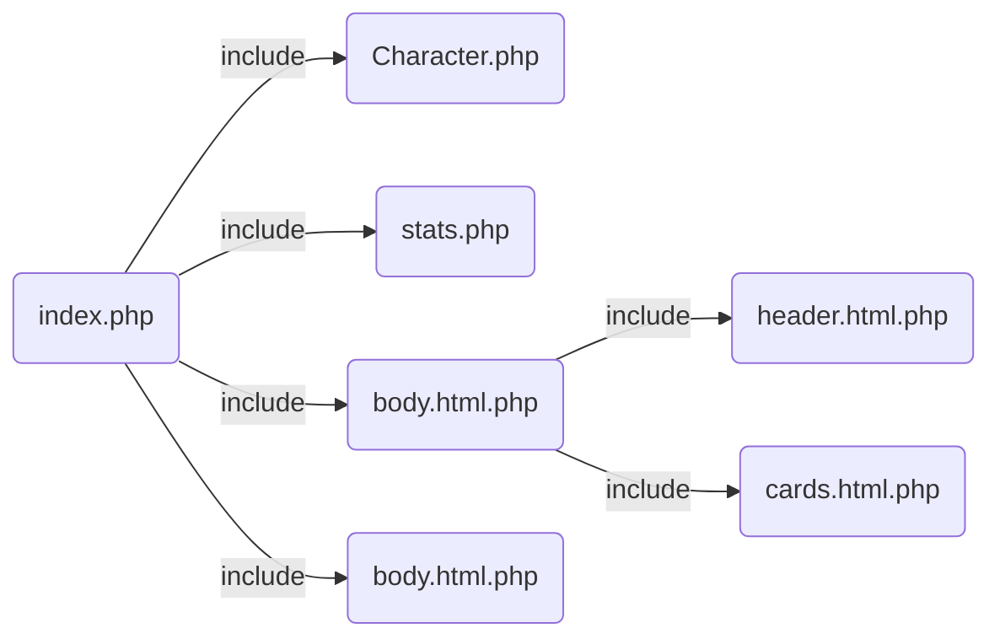

# Objectif

Construire une classe Character et programmer l'histoire d'une rencontre fortuite entre deux Superman et Batman.


# Structure



#  Notes

  

<p>
POO améliore lisibilité, maintenabilité et réutilisabilité du code.
Les recommendations PSR sont des conventions de codage.
</p>

> par exemple le nom du fichier doit être le même que
le nom de la classe.

<p>
Une déclaration sauf constante se type. On utilise des SETTERS et des GETTERS pour les manipuler. $this faisant référence à l'instance.
</p>
<p>
Le __construct et __destruct sont des méthodes dites <i>magique</i> Contructor à la création d'une instance, destructor / unset à la destruction d'une instance.
</p>
<p>
Les classes enfants qui <i>extend</i> peuvent acceder à la propriété/var <i>protected</i> de la classe parente.
<br> Les seules méthodes accessibles d'une instance sont dites de visibilité <i>public</i> . Les constantes, propriétés doivent être <i>private</i> . 
</p>
<p>
La portée statique <i>static</i> et son opérateur <i>::</i> permettent s'acceder à l'attribut statique sans passer par une instance d'objet. Donc pas de $this dans une methode statique. La classe se comporte comme une librairie si elle contient nombre de methode statique. Propriété, methode, constante peuvent être statique.
</p>

## Precision sur l'héritage
<p>
Les classes enfants qui <i>extend</i> peuvent acceder à la propriété/var <i>protected</i> de la classe parente. Les parents ne peuvent pas accéder aux classes enfants.
</p>

```php
class MyChild extends  MyParent {
	public  function  __construct(){
		// protected (last name) is accessible in the child
		// class but not outside the class protected 
		// lastname inherited from MyParent
		echo  $this->lastname; // print Dupont
		}
	}
```
MyChild extends from MyParent :

```php
class MyParent {
	protected string $lastname =  "Dupont";
	}
```
### Interface

Une interface est un peu comme en ts sans être explicitement du "typage". Elle contient des déclarations de methods que la classe qui l'implémente doit absolument déclaré.

```php
interface Vehicle {
  public function start();
  public function stop();
}
```
La classe Car <i>implements</i> Vehicle :

```php
class Car implements Vehicle {
  public function start() {
    // Implementation of start method for Car
  }

  public function stop() {
    // Implementation of stop method for Car
  }
}
```
### Final keyword

Une classe / prop / method <i>final</i> ne peut pas être héritée. La méthode <i>final</i> ne peut pas être redéfinie.

### Abstract keyword

Une classe / prop / method <i>abstract</i> ne peut pas être instanciée. Une classe <i>abstract</i> peut contenir des méthodes <i>abstract</i> et des méthodes normales. Une classe <i>abstract</i> force l'héritage. Une méthode <i>abstract</i> doit être définie dans la classe enfant, pas dans la classe abstract (comme declaration en TS).


```php	
abstract class MyAbstractClass {
    abstract public function myAbstractMethod();
}
```


